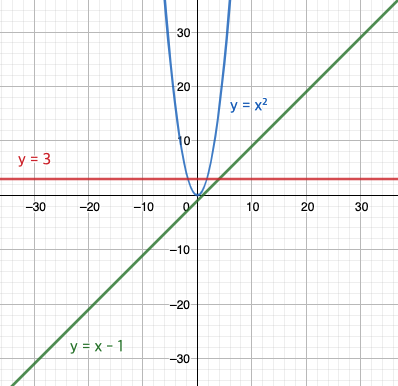

# 1. Asymptotic Notation (1)

지난번 글에서 알고리즘의 효율성이 중요하다는 이야기를 했었습니다. 그렇다면 알고리즘의 효율성은 어떤 기준을 가지고 판단할까요? 쉽게 생각해 봤을때, 우선 알고리즘을 구현한 프로그램의 수행 시간을 생각해볼 수 있을 것입니다. 하지만 수행 시간은 같은 컴퓨터(정확히는 프로세서) 내에서만 유효하고, 기술이 발전해서 장비가 빨라지면 자연스럽게 수행 시간이 빨라지기 때문에 절대적인 지표로 사용하기는 어렵습니다.

따라서 구체적인 동작 시간 자체보다는 알고리즘의 연산 수를 대략적으로 파악하여 효율성을 분석합니다. 이렇게 해야 일단 장비의 사양에 관계 없이 측정할 수 있습니다. 그리고 연산 수가 적어야 알고리즘이 보다 빨리 끝날 것이고, 적은 연산 수로 같은 결과를 얻어내면 더 효율적인 알고리즘이 되기 때문에 ‘연산 수'로 알고리즘의 효율성을 분석하는 것은 자연스러운 접근이 됩니다.

예를 들어 다음 3개의 알고리즘을 비교해 보겠습니다.

> **[알고리즘1] 1 부터 $n$ 까지의 자연수의 총합을 구하는 알고리즘**
> 1에 2를 더하고, 그 결과에 3, 4, 5, ..., $n$ 을 차례로 더한다.

> **[알고리즘2] 1 부터 $n^2$ 까지의 자연수의 총합을 구하는 알고리즘**
> $n^2$ 을 계산해둔다. 이제 1에 2를 더하고, 그 결과에 3, 4, 5, ..., $n^2$ 을 차례로 더한다.

> **[알고리즘3] 1 부터 $n$ 까지의 자연수의 총합을 구하는 알고리즘**
> $n + 1$ 을 계산하고, 그 결과에 $n$ 을 곱한 다음 2로 나눈다.

먼저 각 알고리즘의 연산 수를 분석해보겠습니다.

- [알고리즘1]은 총 $n-1$ 회의 덧셈 연산을 해야 합니다.
- [알고리즘2]는 우선 $n^2$ 을 계산하는데 1번, 그리고 $n^2 - 1$ 회의 덧셈 연산이 있으므로 총 $n^2$ 회 연산을 해야 합니다.
- [알고리즘3]은 $n+1$ 계산, $n$ 을 곱하는 연산과 2로 나누는 연산을 하므로 총 3회 연산을 해야 합니다.

위로부터 다음과 같은 관찰을 할 수 있습니다.

- [알고리즘3]은 [알고리즘1]과 같은 일을 하면서 연산의 수가 적게 필요하므로 [알고리즘3]이 더 효율적인 알고리즘입니다. (단, $n \geq 5$)
- 같은 $n$ 에 대하여 [알고리즘2]는 [알고리즘1] 보다 연산 수가 많으므로 **같은 기계에서 실행한다면** [알고리즘2]가 훨씬 오래 걸릴 것입니다. (단, $n \geq 2$)

위 알고리즘들은 (앞으로 만날 알고리즘들에 비해) 상당히 간단하기 때문에 정확한 연산의 수를 파악할 수 있었습니다. 하지만 알고리즘이 복잡해지기 시작하면 정확한 연산 수를 파악하기는 어려울 뿐만 아니라, 사실 정확한 연산 수를 파악하는 것이 그다지 중요하지 않습니다.

## 알고리즘의 점근적 분석

**알고리즘의 효율성 분석은 입력의 크기가 충분히 클 때 하기 때문입니다!** 위에서 $n$ 이 정말 큰 숫자가 된다고 하면 [알고리즘1]의 $n - 1$ 회 연산에서 사실상 중요한 항은 $n$ 이 됩니다. 마치 수학에서 $\displaystyle \lim_{n \rightarrow \infty} (n^2 - n) = \infty$ 인것을 알고 있는데, $n^2$ 이 무한히 커지는 속도가 $n$ 이 무한히 커지는 속도보다 빨라 $n$ 을 빼는 것이 결과에 영향을 주지 못하는 현상과 비슷합니다. 그래서 정확한 연산 수 보다는 주로 연산 수에 가장 많은 영향을 주는 부분을 주목해서 대략적인 연산 수만 파악합니다.

그런데 왜 효율성 분석을 **입력의 크기가 충분히 클 때** 할까요? 현대의 컴퓨터들은 옛날에 비해 매우 빨라졌기 때문에 연산 수가 적으면 프로그램이 금방 끝납니다. 제 컴퓨터 (Apple M1 Pro, 10 Core) 에서 $n = 10$ 으로 두고 각 알고리즘의 수행 시간을 측정해보니 모두 0 ms 라고 나왔습니다.<sup><a id="fn-1-ref" href="#fn-1">[1]</a></sup> 입력의 크기가 작아서 연산 수가 적으면 효율성 분석이 의미가 없을 정도로 프로그램이 금방 끝납니다. (측정에 사용한 코드는 아래에 첨부했습니다.)

```text
❯ javac Main.java; java Main
[sum from 1 to n] - result: 55, took 0 ms.
[sum from 1 to n^2] - result: 5050, took 0 ms.
[sum from 1 to n optimized] - result: 55, took 0 ms.
```

하지만 $n = 50,000$ 쯤 된다면 어떨까요?<sup><a id="fn-2-ref" href="#fn-2">[2]</a></sup> 이번에 [알고리즘1]은 1 ms 밖에 걸리지 않은 반면, [알고리즘2]는 785 ms가 걸렸고, [알고리즘3]은 여전히 0 ms 걸렸습니다. 같은 일을 하는 [알고리즘1], [알고리즘3]을 비교해보면 [알고리즘3]이 월등히 효율적임을 알 수 있습니다.

```text
❯ javac Main.java; java Main
[sum from 1 to n] - result: 1250025000, took 1 ms.
[sum from 1 to n^2] - result: 3125000001250000000, took 785 ms.
[sum from 1 to n optimized] - result: 1250025000, took 0 ms.
```

즉 이로부터 우리는 알고리즘의 효율성은 입력의 크기가 클 때 비로소 나타남을 알 수 있습니다. $n$ 이 계속 커지면 연산 수가 $n$ 에 비례하는 [알고리즘1]의 수행 시간은 계속 늘어나겠지만, 연산 수가 3회로 고정되어 있는 [알고리즘3]은 늘어나지 않을 것입니다.



이처럼 입력의 크기가 충분히 클 때 알고리즘의 연산 수 (곧 수행 시간)를 분석하는 것을 알고리즘의 **점근적 분석** (asymptotic analysis) 라고 합니다. 그리고 입력의 크기가 커질 때 분석을 통해 얻은 연산 수가 증가하는 비율을 알고리즘의 **점근적 증가율**(asymptotic growth)이라고 합니다. 위 [알고리즘1]의 점근적 증가율은 $n$ 입니다. $n$ 에 비례해서 연산 수가 증가하기 때문입니다.<sup><a id="fn-3-ref" href="#fn-3">[3]</a></sup>

마지막으로 점근적 증가율을 표기하는 방법을 **점근적 표기법**(asymptotic notation)이라고 부릅니다. 점근적 표기법은 알고리즘의 효율성을 논의할 때 사용하는 '언어'이기 때문에 매우 중요하여, 이번 글에서는 점근적 표기법에 대해서 정리했습니다.

사실 점근적 표기법이 알고리즘 분야에서만 사용되는 것은 아닙니다. 일반적으로 **함수의 증가율**을 다룰 때 등장하는 개념입니다. 알고리즘의 연산 수 또한 **입력에 대한 함수**가 되기 때문에 함수의 증가율로 표현하기 적합합니다.

<p id="fn-1">1: 실제로 0초가 걸린 것은 아니고, 0.5 ms 보다도 짧게 걸렸다는 의미로 이해해주시면 됩니다. 아마 옛날의 느린 컴퓨터로 측정하면 절대 0 ms 라고 나오지는 않을 것입니다.<a href="#fn-1-ref">&#8617;</a></p>

<p id="fn-2">2: 5만이라는 숫자가 비현실적으로 느껴질지도 모르겠으나, 5만개 이상의 데이터를 처리하는 일은 현실에서 꽤나 자주 발생합니다.<a href="#fn-2-ref">&#8617;</a></p>

<p id="fn-3">3: 사실 알고리즘이 사용하는 메모리에 대해서도 비슷하게 분석을 합니다. 하지만 메모리는 어느 정도 조절이 가능하고 시간에 비해 훨씬 값이 싸기 때문에 점근적 분석을 한다고 하면 주로 알고리즘의 수행 시간을 의미하는 경우가 많습니다. 뒤에서 조금 더 자세히 설명합니다.<a href="#fn-3-ref">&#8617;</a></p>

---

## 점근적 표기법

점근적 표기법에서는 계수를 무시합니다. $f(n) = 10n$ 이나 $g(n) = 100n$ 이나, 물론 $g(n)$ 의 값이 실제로 더 크겠지만 $n$ 의 값이 한없이 커지면 계수의 차이는 거의 무의미하기 때문입니다.

그리고 특별한 언급이 없어도, $n \geq 0$ 임을 전제로 하고 있습니다. 점근적 분석에서는 $n$ 이 한없이 클 때 하는 것이고, 알고리즘의 점근적 분석에서도 입력의 크기(데이터 수)나 수행 시간이 음수일 수는 없기 때문입니다.

### Big-$\mathcal{O}$ Notation

먼저 $\mathcal{O}(f(n))$ 은 점근적 증가율이 $f(n)$ 을 **넘지 않는** 모든 함수의 **집합**입니다. 예를 들어, 다음이 성립합니다.

$$6n^2 + 3 \in \mathcal{O}(n^2) \qquad 7n-2 \in \mathcal{O}(n^2)$$

함수 $6n^2 + 3$ 은 점근적 증가율이 $n^2$ 과 같기 때문에 $\mathcal{O}(n^2)$ 인 것이고, 함수 $7n-2$ 는 점근적 증가율이 $n$ 으로, $n^2$ 보다 작기 때문에 $\mathcal{O}(n^2)$ 입니다. 즉 쉽게 말하면, 두 다항식 $f(n), g(n)$ 에 대하여 $g(n) \in \mathcal{O}(f(n))$ 이라는 것은 $g(n)$ 의 차수가 $f(n)$ 의 차수보다 작거나 같다는 뜻입니다.

$\mathcal{O}$-표기법은 직관적으로 $\leq$ 와 같은 의미라고 생각하면 됩니다. 따라서, 다음이 모두 성립합니다.

$$2n\log n + \sqrt{n}, 500, n^2, \frac{1}{n} \in \mathcal{O}(n^2)$$

### Big-$\Omega$ Notation

$\Omega(f(n))$ 은 점근적 증가율이 **적어도** $f(n)$ 인 모든 함수의 **집합**입니다. 예를 들어, 다음이 성립합니다.

$$6n^2 + 3 \in \Omega(n) \qquad 7n-2 \in \Omega(n)$$

함수 $6n^2 + 3$ 은 점근적 증가율이 $n^2$ 으로 적어도 $n$ 이기 때문에 $\Omega(n)$ 인 것이고, 함수 $7n-2$ 는 점근적 증가율이 $n$ 과 같기 때문에 $\Omega(n)$ 입니다. 위 $\mathcal{O}$-표기법과 비슷하게, 두 다항식 $f(n), g(n)$ 에 대하여 $g(n) \in \Omega(f(n))$ 이라는 것은 $g(n)$ 의 차수가 $f(n)$ 의 차수보다 크거나 같다는 뜻입니다.

$\Omega$-표기법은 직관적으로 $\geq$ 와 같은 의미라고 생각하면 됩니다. 따라서, 다음이 모두 성립합니다.

$$n^3, n^2 \log n + n^{1.5}, n\sqrt{n} \in \Omega(n)$$

### 예시

위에서 분석했던 3개의 알고리즘에 대해 점근적 표기법을 적용해 보겠습니다.

- [알고리즘1]의 연산 수는 $\mathcal{O}(n)$ 입니다.  그리고 $\Omega(n)$ 이기도 합니다.
- [알고리즘2]의 연산 수는 $\mathcal{O}(n^2)$ 입니다. 그리고 $\Omega(n^2)$ 이기도 합니다.
- [알고리즘3]의 연산 수는 $\mathcal{O}(1)$ 입니다. 그리고 $\Omega(1)$ 이기도 합니다.

적고 보니 위 3개의 알고리즘은 $\mathcal{O}$, $\Omega$ 안에 들어가는 함수가 모두 일치합니다. 이런 경우에는 $\Theta$-표기법을 사용할 수 있습니다!

### Big-$\Theta$ Notation

$\Theta(f(n))$ 은 점근적 증가율이 $f(n)$ 과 **일치하는** 모든 함수의 **집합**입니다. 예를 들어, 다음이 성립합니다.

$$6n^2 + 3 \in \Theta(n^2) \qquad 7n - 2 \in \Theta(n)$$

두 다항식 $f(n), g(n)$ 에 대하여 $g(n) \in \Theta(f(n))$ 이라는 것은 $f(n)$, $g(n)$ 의 차수가 같다는 뜻입니다. 그래서 다음과 같이 정의할 수도 있습니다.

$$\Theta(f(n)) = \mathcal{O}(f(n)) \; \cap \; \Omega(f(n))$$

$\Theta$-표기법은 직관적으로 $=$ 와 같은 의미라고 생각하면 됩니다. 따라서 다음이 성립합니다.

- [알고리즘1]의 연산 수는 $\Theta(n)$ 입니다.
- [알고리즘2]의 연산 수는 $\Theta(n^2)$ 입니다.
- [알고리즘3]의 연산 수는 $\Theta(1)$ 입니다.

이처럼 $\Theta$-표기법을 사용해서 가급적이면 정확하게 표현하는 것이 좋습니다. 하지만 일반적으로는 프로그램 실행에 걸리는 시간의 최댓값이 궁금하기 때문에 $\mathcal{O}$-표기법을 조금 더 자주 사용하는 경향이 있습니다. 하지만 [알고리즘1]의 연산 수가 $\mathcal{O}(n^n \cdot n!)$ 이라고 해도 맞는 말이 되는데, 이 경우에는 실제 연산 수에 대해서 얻을 수 있는 정보가 거의 없습니다. 그래서 $\mathcal{O}$-표기법을 사용하되, 가급적이면 최대한 정확하게 표현해주는 것이 좋습니다.

한편 위 표기법들은 모두 집합을 나타내기 때문에 $g(n) \in \Theta(f(n))$ 과 같이 $\in$ 기호를 쓰는 것이 올바르지만, 표기법을 남용하여 $g(n) = \Theta(f(n))$ 이라고 더 많이 적습니다.

---

## 시간 복잡도와 공간 복잡도

앞에서 점근적 분석을 통해 알고리즘의 수행 시간을 분석한다고 했습니다. 이를 **시간 복잡도**(time complexity)라고 하며 다음과 같이 표현합니다.

> [알고리즘1]의 시간 복잡도는 $\Theta(n)$ 이다.

혹은 더 간단하게,

> [알고리즘1]은 $\Theta(n)$ 이다.

라고 표현합니다. 시간 복잡도를 표현하기 위해 점근적 표기법을 사용하는 것이며, 시간 복잡도가 클수록 알고리즘이 동작하는데 더 많은 시간이 걸린다는 의미로 이해하면 됩니다.

시간 복잡도에 비해 중요도가 떨어져서 자주 언급되지는 않지만 프로그램이 사용하는 메모리를 측정하는 **공간 복잡도**(space complexity)라는 개념도 있습니다. 어떤 프로그램이 입력의 크기 $n$ 에 비례하는 메모리를 사용하면 '공간 복잡도가 $\mathcal{O}(n)$ 이다'라고 표현합니다.

메모리가 많이 필요한 경우 디스크를 추가하는 등의 방법으로 메모리는 쉽게 늘릴 수 있는 반면, 시간이 많이 필요한 경우에는 더 효율적인 알고리즘을 찾거나, 기다리는 수밖에 없습니다.<sup><a id="fn-4-ref" href="#fn-4">[4]</a></sup> 이렇게 메모리는 상대적으로 시간에 비해 조절하기 쉬운 부분이기 때문에 보통 별다른 언급이 없어도 점근적 표기법이 등장하면 시간 복잡도를 의미한다고 생각해도 됩니다.

그렇다고 해서 공간 복잡도가 의미 없는 것은 아닙니다. 메모리도 자원이기 때문에 적게 쓸 수록 좋습니다. 경우에 따라 메모리가 한정된 상황에서 프로그램을 실행시켜야 하는 경우도 있고, 메모리도 종류에 따라 가격이 다릅니다. 최근 컴퓨터에 사용되는 RAM 같은 경우 속도가 빠르지만 그만큼 비싸고, 하드 디스크의 경우 값이 싸지만 속도가 느린 편입니다. 그래서 메모리도 무조건 많이 쓸 수는 없고, 현실적인 상황을 고려해서 알고리즘을 선택하게 됩니다. 시간이 정말 중요하면 메모리를 조금 더 써서라도 시간을 줄이는 방향으로, 메모리가 정말 중요하면 조금 오래 걸리더라도 메모리를 줄이는 방향으로 결정합니다.

<p id="fn-4">4: 사람에게 메모리를 다루는 기술은 있지만, 시간을 다루는 기술은 알고리즘 최적화, 프로세서 가속 이외에는 없습니다. 그리고 최적화와 프로세서 가속은 매우 어렵습니다. ㅎㅎ.<a href="#fn-4-ref">&#8617;</a></p>

---

다음 글에서는 점근적 표기법의 엄밀한 정의와 함께 실제로 점근적 분석을 수행하는 방법을 간단하게 살펴보도록 하겠습니다.

---

<script src="https://gist.github.com/calofmijuck/95099aaa5e8cfb67f61c27efa711f156.js"></script>
