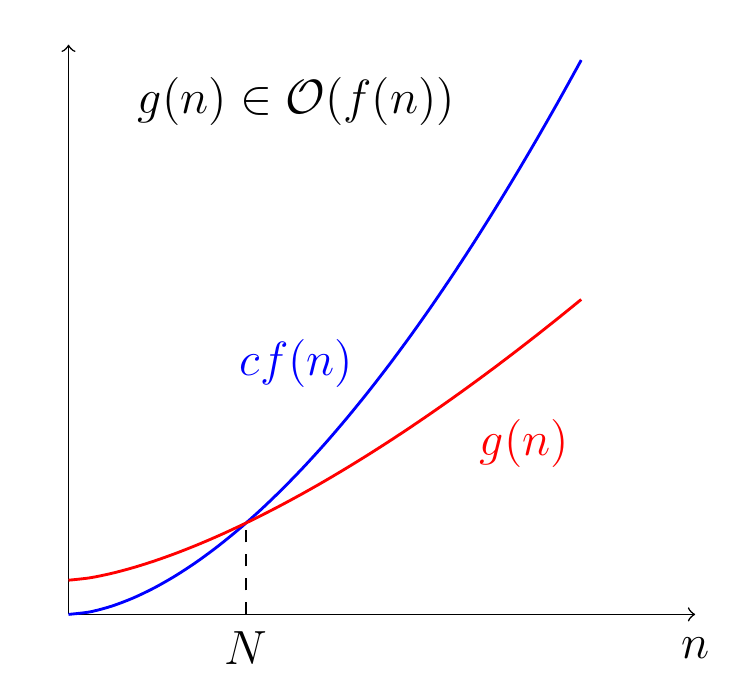
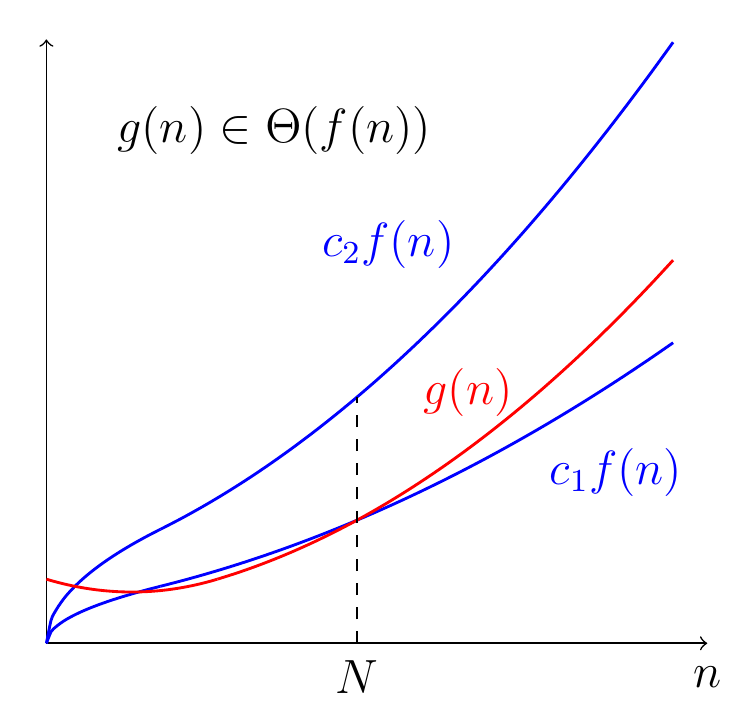

# 2. Asymptotic Notation (2)

지난 글에 이어서 이번에는 점근적 표기법의 엄밀한 정의와 실제로 점근적 분석을 수행하는 방법을 살펴보도록 하겠습니다.

## 점근적 표기법의 엄밀한 정의

점근적 분석은 입력의 크기가 클 때, 즉 $n$ 이 충분히 클 때 수행한다고 했었습니다. 그래서 자연스럽게 $n$ 이 무한대로 가는 극한이 등장하게 되고, 극한을 엄밀하게 정의하는 방법과 굉장히 유사한 형태로 정의됩니다.

### Big-$\mathcal{O}$ Notation

어떤 함수 $g(n)$ 이 $\mathcal{O}(f(n))$ 이라는 것은, 적당한 양수 $c$ 와 자연수 $N$ 이 존재하여, 다음이 성립한다는 뜻입니다.

$$n \geq N \implies 0 \leq g(n) \leq cf(n)$$

이를 조금 더 풀어서 설명해보겠습니다. 적당한 양수 $c$, 자연수 $N$ 이 존재하여 $n$ 이 충분히 커지면 $g(n)$ 의 값이 (또는 점근적 증가율이) $f(n)$ 을 넘지 않는다는 뜻입니다. 어차피 계수는 무시하기로 했었죠. 결국 지난 글에서 살펴본 의미와 동일합니다.



수열의 극한의 엄밀한 정의를 알고 계신 분이라면 굉장히 유사하다고 느끼실 것입니다. 실제로 증명하는 과정도 비슷합니다. 실제로 증명을 한 번 해보겠습니다.

**[예제 1] $n + 6 \in \mathcal{O}(n^2)$ 임을 보여라.**

**[사고방식]** 우리의 관심사는 $n$ 이 충분히 클 때 이므로, $n = 1$ 일 때 $n + 6 \geq n^2$ 인 것은 별로 상관 없습니다. $n$ 이 커지면 자연스럽게 $n^2$ 이 커질 수밖에 없기 때문이죠. 그러면 언제부터 $n^2$ 이 더 크게 될까요?

잠시 연습장을 꺼내서 증명하려는 식이 무엇인지 써봅니다. $n+6 \leq cn^2$ 이군요. $c$ 도 적절히 잡아야 하지만, 사실상 언젠가는 $n^2$ 이 당연히 커질 수밖에 없기 때문에 적당히 $c = 1$ 로 잡아보겠습니다. 이제 연습장을 꺼내 $n^2 - n - 6 \geq 0$ 을 풀어 $n\geq 3$ 를 얻고, $N = 3$ 으로 잡으면 원하는 결과를 얻을 수 있을 것 같습니다! 이제 증명을 적을 준비가 되었습니다.

**[증명]** $c = 1$, $N = 3$ 에 대하여, $n\geq N$ 이면 $0 < n+6 \leq cn^2$ 이므로 $n+6 \in \mathcal{O}(n^2)$ 이다.

생각보다 증명은 짧습니다. 하지만 증명을 적기 위해 매번 $c, N$ 을 잡아야 한다니 비용이 너무 많이 들어간다는 느낌이 있습니다. 이를 쉽게 증명하는 방법이 있는데요, 바로 소개하겠습니다.<sup><a id="fn-1-ref" href="#fn-1">[1]</a></sup>

**[정리] $\displaystyle \lim_{n\rightarrow \infty} \frac{g(n)}{f(n)} = \alpha < \infty$ 이면, $g(n)\in \mathcal{O}(f(n))$ 이다.**

**[참고]** 문맥상 $f(n), g(n)$ 은 모두 양의 값을 가지는 함수이므로 $\alpha \geq 0$ 입니다. (그렇지 않다면 절댓값을 사용합니다!) 그리고 여기서 $\alpha < \infty$ 라고 적은 것은 극한값이 유한 값으로 수렴함을 뜻합니다.

**[증명]** $\displaystyle \lim_{n\rightarrow \infty} \frac{g(n)}{f(n)} = \alpha$ 이므로, 적당한 양수 $\varepsilon > 0$ 에 대하여 적당한 자연수 $N_0 > 0$ 이 존재하여 다음이 성립합니다.

$$n\geq N_0 \implies \left|\frac{g(n)}{f(n)} - \alpha\right| < \varepsilon$$

이를 풀어서 쓰면

$$n \geq N_0 \implies \alpha-\varepsilon < \frac{g(n)}{f(n)} < \alpha +\varepsilon \implies 0 \leq g(n) < (\alpha + \varepsilon) f(n)$$

이 됩니다. 이제 $\mathcal{O}$-표기법의 정의에서 $c = \alpha  + \varepsilon > 0$, $N = N_0$ 로 두면 $g(n)\in \mathcal{O}(f(n))$ 임을 알 수 있습니다.

실제로 극한을 이용한 $g(n)\in \mathcal{O}(f(n))$ 의 정의는 다음과 같습니다.

$$g(n)\in \mathcal{O}(f(n)) \iff \limsup_{n\rightarrow \infty} \frac{|g(n)|}{f(n)} < \infty$$

$\limsup$ 에 대한 자세한 이야기는 이 글의 범위를 넘기 때문에 생략하겠습니다. 하지만 $\displaystyle \lim_{n\rightarrow \infty} \frac{g(n)}{f(n)} < \infty$ 이면 자동으로 $\displaystyle \limsup_{n\rightarrow \infty} \frac{g(n)}{f(n)} < \infty$ 가 된다는 점은 언급하고 넘어가면 좋을 것 같습니다. 극한을 이용해서 쉽게 증명할 수 있다는 의미입니다!

이제 어느 정도 익숙해지셨나요? 나머지도 소개하도록 하겠습니다.

<p id="fn-1">1: 저는 이 정리를 이산수학 중간고사에서 증명하고 사용했었는데 부분점수를 받은 적이 있습니다. 다행히 이의신청을 통해 점수는 모두 받을 수 있었습니다. <a href="#fn-4-ref">&#8617;</a></p>

### Big-$\Omega$ Notation

어떤 함수 $g(n)$ 이 $\Omega(f(n))$ 이라는 것은, 적당한 양수 $c$ 와 자연수 $N$ 이 존재하여, 다음이 성립한다는 뜻입니다.

$$n \geq N \implies 0 \leq cf(n) \leq g(n)$$

$n$ 이 충분히 클 때 $g(n)$ 의 점근적 증가율이 $f(n)$ 보다 크다는 얘기를 하고싶다는 것을 쉽게 눈치챌 수 있습니다.


그리고 다음은 거의 자명합니다.

$$g(n) \in \Omega (f(n)) \iff f(n) \in \mathcal{O}(g(n))$$

### Big-$\Theta$ Notation

사실 $\Theta$-표기법의 엄밀한 정의는 지난 글에서도 나왔습니다. $\mathcal{O}(f(n)) \cap \Omega(f(n)) = \Theta(f(n))$ 이기 때문이죠. 결국 이를 풀어 적으면 위 두 표기법과 비슷하게 정의할 수 있습니다.

어떤 함수 $g(n)$ 이 $\Theta(f(n))$ 이라는 것은, 적당한 양수 $c_1, c_2$ 와 자연수 $N$ 이 존재하여, 다음이 성립한다는 뜻입니다.

$$n \geq N \implies 0\leq c_1 f(n) \leq g(n) \leq c_2f(n)$$

$n$ 이 충분히 클 때 $g(n)$ 의 점근적 증가율이 $f(n)$ 과 같다는 뜻입니다.



그리고 정의로부터 자연스럽게 다음도 알 수 있습니다.

$$g(n) \in \Theta(f(n)) \iff g(n) \in \mathcal{O}(f(n)) \text{ and } g(n) \in \Omega(f(n))$$

---

경험상 자주 등장하지 않아서 지난 글에서는 소개하지 않았지만 완결성을 위해 여기서는 소개하겠습니다. 앞서 살펴본 3개의 표기법은 마치 점근적 증가율을 $\leq$, $\geq$, $=$ 처럼 나타내주는 기호였습니다. 왠지 $<$, $>$ 가 빠진 느낌이 들지 않으시나요?

### Little-$o$ Notation

어떤 함수 $g(n)$ 이 $o(f(n))$ 이라는 것은, 적당한 양수 $c$ 와 자연수 $N$ 이 존재하여, 다음이 성립한다는 뜻입니다.

$$n \geq N \implies 0 \leq g(n) < cf(n)$$

자세히 살펴보니 $\mathcal{O}$-표기법과 비슷한데 마지막에 등호 하나만 빠졌습니다. $o$-표기법은 점근적 증가율이 **더 작은** 함수들을 모은 집합입니다. $<$ 의 역할을 하는 기호입니다.

극한으로는 다음과 같이 정의합니다.

$$g(n)\in o(f(n)) \iff \lim_{n\rightarrow \infty} \frac{g(n)}{f(n)} = 0$$

그리고 당연히 $o(f(n)) \subset \mathcal{O}(f(n))$ 입니다.

### Little-$\omega$ Notation

마지막으로, 어떤 함수 $g(n)$ 이 $\omega(f(n))$ 이라는 것은, 적당한 양수 $c$ 와 자연수 $N$ 이 존재하여, 다음이 성립한다는 뜻입니다.

$$n \geq N \implies 0 \leq cf(n) < g(n)$$

마찬가지로 살펴보니 $\Omega$-표기법과 비슷한데 마지막에 등호 하나만 빠졌습니다. $\omega$-표기법은 점근적 증가율이 **더 큰** 함수들을 모은 집합입니다. $>$ 의 역할을 하는 기호입니다.

극한으로는 다음과 같이 정의합니다.

$$g(n)\in o(f(n)) \iff \lim_{n\rightarrow \infty} \frac{g(n)}{f(n)} = \infty$$

마찬가지로 당연히 $\omega(f(n)) \subset \Omega(f(n))$ 입니다.

---

이상으로 5가지 점근적 표기법의 엄밀한 정의를 모두 살펴봤습니다. 이제 실제 프로그램에 대해서 점근적 분석을 수행하는 방법에 대해서 살펴보겠습니다.

## 점근적 분석을 수행하는 방법

알고리즘의 수행 동작을 자세히 살펴보면, **어떤 대상들에 대해 반복적으로 하는 작업**이 분명히 존재하고 또 **계산한 결과를 어딘가에 저장**하기 마련입니다. 이에 착안하여 시간 복잡도와 공간 복잡도를 분석합니다.

### 시간 복잡도

우선 수행 동작 각 부분별로 연산 회수가 어느 정도 되는지 **계수를 무시하고** 대략적으로 파악합니다.

예를 들어 $n$ 개의 숫자에 대하여 각각 $f(m)$ 이 걸리는 연산을 한다고 하면, 총 연산 수는 $n \cdot f(m)$ 일 것입니다. 참고로 여기서 $n$ 이라고 적은 것도 사실 $n$ 개의 숫자가 아니라 $2n$, $n/2$ 개의 숫자일 수도 있습니다. 하지만 점근적 분석에서 계수는 중요하지 않습니다.

이제 각 부분의 연산 수를 모두 더한 다음, 그 중 **연산 회수 증가율에 가장 큰 영향을 미치는 항만 남기고 제거**합니다. 만약 총 연산 수가 $n^2 + n + \log n$ 이라면, $n^2$ 의 영향이 가장 크므로, 최종 시간 복잡도는 $\mathcal{O}(n^2)$ 이 되는 것입니다.

### 공간 복잡도

공간 복잡도도 마찬가지입니다. 수행 동작 각 부분별로 사용하는 메모리가 어느 정도 되는지 계수를 무시하고 대략적으로 파악합니다.

예를 들어 $n$ 개의 숫자에 각각에 대하여 어떤 연산을 해서 얻은 $g(m)$ 개의 결과를 저장한다면 총 메모리 사용량은 대략 $n \cdot g(m)$ 일 것입니다. 추가로, 언어의 자료형에 따라 실제로 사용하는 메모리는 다르겠지만, 계수는 중요하지 않습니다.<sup><a id="fn-2-ref" href="#fn-2">[2]</a></sup>

이제 각 부분의 메모리 사용량을 모두 더한 다음, 그 중 **메모리 사용량 증가율에 가장 큰 영향을 미치는 항만 남기고 제거**합니다.

<p id="fn-2">2: 예를 들어 C 언어의 `int` 자료형은 1개 당 4 바이트를 사용하기 때문에 점근적 분석이 아니라 실제 메모리 사용량을 원한다면 자료형의 크기도 곱해줘야 합니다.<a href="#fn-2-ref">&#8617;</a></p>

---

## 예제: 행렬 곱셈

실제로 행렬 곱셈 알고리즘을 보고 점근적 분석을 해보겠습니다. $n \times n$ 행렬

$$A = (a_{ij})_{n \times n},\quad B = (b_{ij})_{n \times n} \qquad (a_{ij}, b_{ij} \in \mathbb{Z})$$

가 주어질 때, 두 행렬의 곱 $C = AB = (c_{ij})_{n\times n}$ 는 다음과 같이 정의됩니다.

$$c_{ij} = \sum_{k = 1}^n a_{ik} b_{kj} \qquad (1 \leq i, j \leq n)$$

이는 곧 행렬 $C$ 의 원소 하나를 구할 때마다 $A$ 의 행과 $B$ 의 열을 내적(dot product)하는 것으로 이해할 수 있습니다. 알고리즘의 동작을 코드로 옮겨보도록 하겠습니다.

```java
int[][] matrixMultiplication(int n, int[][] A, int[][] B) {
	int[][] C = new int[n][n]; // 결과는 n x n 행렬
	for (int row = 0; row < n; ++row) { // (1)
		for (int column = 0; column < n; ++column) { // (2)
			for (int k = 0; k < n; ++k) { // (3)
				C[row][column] += A[row][k] * B[k][column];
			}
		}
	}
	return C;
}
```

코드를 자세히 보겠습니다. (1)은 $C$ 의 각 행마다 어떤 동작을 하겠다는 의미이고, (2)는 (1)에서 선택된 $C$ 의 행에 있는 각 원소(열)마다 어떤 동작 (3)을 하겠다는 의미입니다. 그리고 (3)에서 $A$ 의 행과 $B$ 의 열을 내적하고 있습니다.

### 시간 복잡도

**시간 복잡도**는 어떻게 될까요? 우선 부분별 연산 수를 대략적으로 파악해 보겠습니다.

(3)의 연산 수부터 파악해 보겠습니다. 각각 $n$ 개의 원소를 가진 두 벡터를 내적하는 연산이므로, $n$ 회의 곱셈과 $n$ 회의 덧셈이 일어납니다. 그런데, **`for` 문을 실행하기 위해 필요한 연산도 고려해야 합니다!** 처음에 `k` 를 $0$ 으로 초기화하고 반복문 실행 조건을 검사하는 부분과, 이후 반복할 때마다 `k` 의 값을 $1$ 씩 더하고, 조건을 또 비교하는 부분을 전부 고려해야 합니다. 이러한 부분의 연산 수를 정확히 구하는 것은 조금 까다롭고 심지어 귀찮기까지 합니다.

하지만 점근적 분석을 할 때는 **계수도 무시하고, 증가율에 가장 큰 영향을 미치는 항만 따지기 때문**에 이런 세세한 부분까지는 고려하지 않아도 됩니다. 일반적으로 `for` 문을 실행하기 위한 연산보다 `for` 문 안에서 실행되는 연산이 훨씬 많습니다. 그러므로 (3)의 연산 수는 대략 $n$ 회라고 생각해도 무방합니다.<sup><a id="fn-3-ref" href="#fn-3">[3]</a></sup><sup><a id="fn-3-ref" href="#fn-3">[4]</a></sup>

이제 (1), (2)를 종합하면 행렬 $C$ 의 각 원소들마다 (3)을 하겠다는 의미이기 때문에, $C$ 의 성분 수인 $n^2$ 개만큼 반복을 하게 됩니다. 마찬가지로 이중 `for` 문을 실행하기 위한 연산은 무시해도 괜찮습니다. 이제 (3)의 연산 수가 대략 $n$ 이었으므로 최종 시간 복잡도는 $n^2 \cdot n = n^3$ 이 됩니다. 이 알고리즘은 $\mathcal{O}(n^3)$ 입니다.

### 공간 복잡도

**공간 복잡도**는 어떨까요? 우선 행렬 $A, B, C$ 의 성분들을 모두 저장하고 있으므로 $3n^2$ 만큼의 정수가 사용됩니다. 그리고 `for` 문에서 사용하는 `row`, `column`, `k` 등의 변수도 분명 메모리를 사용할 것입니다. 그래서 따지고 보면 $3n^2 + 3$ 개의 정수가 사용되었지만, (어쩌면 내부적으로 더 썼을지도 모릅니다!) 계수는 무시하고 증가율에 가장 큰 영향을 미치는 항만 따지므로 최종 공간 복잡도는 $\mathcal{O}(n^2)$ 입니다. 추가로 만약 실제 메모리 사용량이 궁금하다면, `int` 자료형이 4 바이트를 사용한다는 점도 고려하여 정수 개수에 $4$ 를 곱해야 할 것입니다.

<p id="fn-3">3: 내적 연산 속에 포함된 덧셈 과정이 애초에 <code>for</code> 문 연산을 통해 이뤄지고 있다고 생각해도 괜찮습니다. <a href="#fn-3-ref">&#8617;</a></p>

<p id="fn-4">4: 언어마다 연산의 구현 방법이 다를 수도 있으며, 연산마다 비용도 다를 수 있습니다. 일반적으로 곱셈이 덧셈보다 더 오래 걸리기 때문에 곱셈 1회와 덧셈 1회는 엄밀하게 따지면 같은 1회라고 보기는 어렵습니다. 언어/컴파일러의 차이나 특성까지 고려하며 최적화 하는 과정은 실제로 실행 시간을 줄이기 위해 필요하지만, 알고리즘 자체는 언어나 컴파일러와 독립적으로 존재하기 때문에, 언어/컴파일러의 차이를 염두에 두더라도 점근적 분석을 할 때는 이를 적당히 무시해도 괜찮습니다. 단, 알고리즘을 구현할 때는 꼭 신경 써야 합니다. <a href="#fn-4-ref">&#8617;</a></p>

---

이상으로 알고리즘의 효율성을 분석하는 점근적 분석과 점근적 표기법에 대해 알아봤습니다. 수학적 정의는 잊어버리셔도 좋습니다. 하지만 점근적 분석을 실제로 하는 방법은 앞으로 두고두고 쓰일테니 반드시 기억하고 있어야 합니다. 그리고 이를 바탕으로 실제로 코드를 작성하는 경우에도 효율성을 고려하며 작성하는 습관을 들일 수 있도록 하는 것이 좋습니다.

이제 사전 준비가 끝났으니, 이제 다음 글부터는 본격적으로 자료구조와 알고리즘을 하나씩 소개해 나가도록 하겠습니다!
