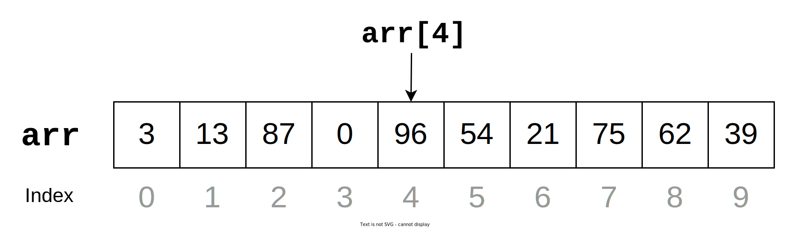

# 3. Arrays and Lists

이번 글에서는 활용 빈도가 매우 높은 자료구조인 **배열**(Arrays)과 **리스트**(Lists)에 대해 알아보도록 하겠습니다.

## Arrays

배열은 인덱스(index)와 인덱스에 대응하는 원소들로 이루어진 자료구조입니다. 일반적으로 원소들은 모두 동일한 타입이며, 원소들이 메모리 상으로 연속적으로 존재하며, 언어마다 다르겠지만 보통 고정된 길이를 가집니다.

그림에서 보이는 것처럼, 보통 여러 개의 데이터를 저장할 때 사용합니다. 아래 코드는 C++에서 배열을 사용하는 방법입니다.

### 배열 C++ 코드

**배열의 인덱스는 0부터 시작합니다!**

원소가 $n$ 개 있는 배열의 인덱스는 $0$ 부터 $n-1$ 입니다. 이 범위를 벗어난 인덱스를 이용하면 올바르지 않은 참조가 되기 때문에 프로그래머가 의도하지 않은 동작이 일어날 수도 있습니다.

### 시간 복잡도

항상 새로운 자료구조가 나오면 우리는 시간 복잡도가 궁금합니다. 보통 삽입, 삭제, 검색 등을 궁금해하는 편입니다.

우선 **검색**의 경우 배열의 인덱스를 사용해서 합니다. $i$-번째 원소가 필요하다면 `arr[i]` 와 같이 쓰면 되고, 내부적으로 $i$-번째 원소가 저장된 곳을 계산해서 값을 가져옵니다. 이 과정은 $\mathcal{O}(1)$ 에 동작합니다.

다음은 **삽입** 연산입니다. 만약 $i$-번째 원소 $a$를 덮어씌우는 연산의 경우, 위와 비슷하게 $i$-번째 원소가 저장된 곳을 계산하여 그 곳에 $a$를 저장하면 되므로 이 과정 또한 $\mathcal{O}(1)$ 에 동작합니다.

한편 덮어씌우는 연산이 아니라, $i$-번째 위치에 새로운 원소를 넣고 나머지 원소를 뒤로 한 칸씩 밀어야 한다면 어떨까요? 쉬운 설명을 위해 배열의 길이가 10이라고 해보겠습니다. 만약 $i = 10$ 이라고 한다면, 밀어야 할 원소가 없으므로 상수 시간만에 끝납니다. 그런데 반대로 $i = 0$ 이라고 한다면, 이미 존재하는 10개의 원소를 모두 뒤로 한 칸씩 밀어야 $a$가 들어갈 공간이 생길 것입니다. 이를 일반화 하여 배열의 길이가 $n$ 이라면, 최악의 경우 모든 원소를 한 칸씩 밀어줘야 하므로 삽입 연산은 $\mathcal{O}(n)$ 임을 알 수 있습니다.

마지막으로 **삭제** 연산은 삽입 연산과 거의 비슷합니다. $i$-번째 원소를 그냥 지운다면 원소가 존재하는 곳으로 찾아가서 지우면 끝입니다. 이 과정도 $\mathcal{O}(1)$ 입니다. 그런데 위와 같이 $i$-번째 원소를 지우고, 나머지 원소를 앞으로 한 칸씩 당겨서 빈 공간이 없게 한다면 어떨까요? 최악의 경우 $i = 0$ 일 때, 맨 앞의 원소를 지우고 나머지를 전부 앞으로 한 칸씩 당겨야 합니다. 따라서 삭제 연산은 $\mathcal{O}(n)$ 임을 알 수 있습니다.

## Lists

리스트 자료구조는 배열과 거의 유사하지만, (언어에 따라) 약간의 차이가 있습니다. 언어에 따라 다를 수 있지만, 원소들이 모두 동일한 타입일 필요는 없고, **일반적으로 길이가 가변적**입니다. 거의 차이가 없기 때문에 바로 코드 예제로 넘어가겠습니다.

C++에서는 리스트 자료구조를 위해 STL의 `vector<T>` 를 주로 사용합니다.

Java 코드도 함께 첨부했습니다.

리스트를 사용했을 때 편한 점은 인덱스 범위가 올바르지 않을 때 예외 처리가 내부적으로 어느 정도 구현되어 있다는 점입니다.

### 시간 복잡도

마찬가지로 삽입, 삭제, 검색의 시간 복잡도를 알아보겠습니다.

삽입, 삭제, 검색 모두 배열의 시간복잡도 설명과 달라질 이유가 없습니다. 삽입은 $\mathcal{O}(n)$, 삭제도 $\mathcal{O}(n)$, 검색은 $\mathcal{O}(1)$ 입니다.

### 맨 끝에 원소를 추가하는 연산의 시간 복잡도

리스트에 있는 연산 중에는 '리스트의 맨 끝에 원소 추가' 연산이 있습니다. 대표적으로 다음과 같습니다. 코드의 동작은 모두 리스트를 만들고 맨 끝에 원소 10을 추가합니다.

이 연산의 시간 복잡도를 C++ 기준으로 분석해 보겠습니다. (다른 언어도 결국 유사합니다.)

분석하기에 앞서, 리스트를 생성하면 컴퓨터의 특정 메모리 위에 리스트를 위한 공간이 예약됩니다. (정확히는 Heap 영역) 리스트 또한 원소들이 메모리 상에서 연속적으로 존재하기 때문에 `push_back` 이 일어나면 리스트의 마지막 원소 뒤에 새로운 원소를 넣어주게 됩니다. 그런데 `push_back` 연산이 많이 수행되어서 계속 새로운 원소를 리스트 맨 뒤에 넣다 보면, 새로운 원소를 넣고자 하는 메모리 공간이 이미 사용 중인 경우가 발생합니다.

C++에서는 이런 경우 현재 차지한 메모리 양의 2배가 연속적으로 들어갈 수 있는 메모리 영역을 찾아 그 곳을 사용하기로 하고, 새로운 영역으로 기존 리스트의 원소를 전부 복사하고, 그 뒤에 새로운 원소를 저장합니다. 따라서 `push_back` 은 최선의 경우 $\mathcal{O}(1)$ 만에 끝나지만, 최악의 경우 현재보다 2배 넓은 메모리 공간을 찾아 모든 원소를 복사해야 할 수도 있기 때문에 시간 복잡도가 $\mathcal{O}(n)$ 이 됩니다.

하지만 정말 $\mathcal{O}(n)$ 이 `push_back` 의 동작을 잘 설명해주고 있을까요? 2배 넓은 메모리 공간을 찾아 모든 원소를 복사하는 일은 리스트가 길어지면 길어질수록 잘 안 일어납니다! 현재 리스트에 10개의 원소가 있고, `push_back` 연산이 수행되면서 20개를 저장할 수 있는 곳으로 옮겨갔다고 가정해보겠습니다. 그렇다면 다음으로 전체를 복사하는 일은 `push_back` 연산이 9회 더 일어난 뒤일 것입니다. 한편 `push_back` 연산이 정말로 9회 더 일어나서 20개도 가득 찼다고 하면, 다음 `push_back` 연산이 발생하면 40개를 저장할 수 있는 곳으로 옮겨갈 것이기 때문에 다음으로 전체 복사하는 일은 삽입이 19회 더 일어난 뒤가 됩니다. 결국 최악의 경우 `push_back` 연산이 $\mathcal{O}(n)$ 이긴 하지만, 실제로 전체 복사는 자주 일어나지 않고, 대부분의 경우 $\mathcal{O}(1)$ 가 됩니다. 이와 같은 경우에는 시간 복잡도는 어떻게 계산하는 것이 좋을까요?

`push_back` 연산에서 가장 시간을 잡아먹는 부분은 전체 복사인데, 이 전체 복사의 부담을 $n$회의 `push_back` 호출이 각각 가져갔다고 생각하면 어떨까요? 현재 리스트 원소가 10개인데, 20개를 저장하기 위해 전체 복사가 일어난다면 새롭게 추가되는 원소 하나마다 기존의 원소를 하나씩 복사해 간다고 생각할 수도 있을 것입니다! 이처럼 분석하는 과정을 amortized analysis (분할상환분석)이라고 하고 이 때의 시간 복잡도를 **amortized 시간 복잡도**라고 부릅니다. 정확하지는 않지만 1회 연산이 **평균적으로** 어느 정도 걸리는지를 나타내줍니다.

---

**[정리] `push_back` 연산의 시간복잡도는 amortized $\mathcal{O}(1)$ 이다.**

**[증명]** 원소가 하나도 없는 빈 리스트에 $n$개의 원소를 `push_back` 한다고 해보겠습니다. 리스트가 처음에 $a$개의 원소가 들어갈 만큼 메모리를 예약한 상태라고 가정하겠습니다. 이 때 $n$회 호출이 일어나는 동안 연산 회수를 따져보겠습니다.

우선 전체 연산 회수는 [리스트 맨 뒤 위치에 원소를 저장하기] + [할당 메모리가 2배가 될 때마다 전체를 복사하는데 들어가는 비용] 으로 생각할 수 있습니다. 실제로는 전체 복사가 중간에 여러 번 일어나지만 순서를 바꿔서 먼저 리스트의 맨 뒤에 원소를 저장하는데 드는 연산만 따져보는 것입니다.

그렇다면 총 $n$회의 저장이 일어나고 각각은 $\mathcal{O}(1)$ 이므로, 총 연산은 $\mathcal{O}(n)$ 입니다.

이제 뒷 항이 문제인데, 전체 복사가 몇 번 일어날지를 생각해야 합니다. 전체 복사가 일어날 때 연산 회수를 따져보기 위해 각 전체 복사마다 복사되는 원소의 수를 따져보겠습니다. 처음에는 $a$ 개, 다음에는 $2a$ 개, 다음에는 $4a$ 개 원소가 복사됩니다. 이를 반복하면 $k$ 번째 전체 복사에서는 $a \cdot 2^{k-1}$ 개의 원소를 복사함을 알 수 있습니다. 따라서 $k$ 회 복사가 일어난다면 총 연산수는 다음과 같습니다.

$$a + 2a + 4a + \cdots + 2^{k-1} \cdot a = a \sum_{i = 1}^k 2^{i-1} = a(2^{k} - 1)$$

이제 $n$ 개의 원소를 `push_back` 하는 상황에서 $k$ 의 값이 최대 얼마인지만 파악하면 됩니다. $k$ 번째 전체 복사에서 $a\cdot 2^{k-1}$ 개의 원소가 복사 대상이 되기 때문에 다음 부등식이 성립합니다.

$$ a\cdot 2^{k-1} \leq n < a\cdot 2^k$$

이 부등식을 풀면

$$2^{k-1} \leq \frac{n}{a} < 2^k \implies \log_{2}{\frac{n}{a}}< k \leq \log_{2}{\frac{n}{a}} + 1$$

이고 $k \in \mathbb{N}$ 이므로 $\displaystyle k = \log_{2}{\frac{n}{a}} + 1$ 입니다. 이 $k$ 값을 위에서 구한 복사에 필요한 총 연산 수에 대입하면,

$$a(2^{k} - 1) = a(2^{\log_{2}{\frac{n}{a}} + 1} - 1) = 2a \cdot 2^{\log_{2}{\frac{n}{a}}} - a = 2n - a$$

가 되는 것을 알 수 있습니다. 따라서 복사하는데 드는 비용은 $\mathcal{O}(n)$ 입니다.

이상을 종합하면, $n$회 `push_back` 을 위해 필요한 연산 회수가 $\mathcal{O}(n)$ 이므로, 1회 `push_back` 연산은 평균적으로 $\mathcal{O}(1)$ 이 됨을 알 수 있습니다. $\Box$

즉, `push_back` 이 항상 $\mathcal{O}(1)$ 인 것은 아니고, 때때로 비싼 연산(전체 복사)이 일어나긴 하지만, 전체적인 성능은 평균적으로 $\mathcal{O}(1)$ 이기 때문에 결코 느리지 않다는 사실을 알 수 있습니다.

## Multi-Dimensional Arrays and Lists

위에서 살펴본 배열과 리스트는 1차원 배열/리스트입니다. 행렬 연산 혹은 딥러닝에서 $n$ 차원 텐서를 다루기 위해서는 다차원 배열과 리스트가 필요합니다. 1차원 배열과 크게 다르지 않습니다.

참고로 Java에서는 `List<List<Integer>> a = new ArrayList<>();` 와 같이 사용하고, Python에서는 `a = [[]]` 와 같이 사용합니다.

## 배열과 리스트의 활용

### 언제 배열을 쓰고, 언제 리스트를 사용할까요?

어느 것을 쓰더라도 큰 상관은 없습니다. 배열/리스트 모두 연속된 데이터를 나타내기 때문에 배열을 활용하는 코드를 리스트를 사용하는 코드로 바꿀 수 있으며, 그 반대 방향으로도 가능합니다.

다만 일반적으로 배열은 고정 길이이고, 리스트는 가변 길이이기 때문에 리스트의 길이가 조절될 때(`push_back` 또는 `resize`)는 추가 연산이 필요할 수 있다는 점을 알고 있어야 합니다.<a id="fn-1-ref" href="#fn-1">[1]</a>

1: 리스트를 활용한 코드에서 배열로 바꿨더니 실행 시간이 10배 빨라진 경험이 있습니다. 리스트의 길이를 조정하는 과정이 자주 일어나게 되면 생각보다 비싼 연산이 됩니다. <a href="#fn-1-ref">&#8617;</a>

### 최소, 최대 (BOJ 10818)

[문제 링크](https://www.acmicpc.net/problem/10818)

$N$ 개의 정수가 주어지고, 최솟값과 최댓값을 찾는 문제입니다.

$N$ 개의 정수를 입력으로 받아야 하는데, 개수가 계속 달라지기 때문에 변수를 한꺼번에 여러 개 선언할 수 있는 방법이 필요하고, 이럴 때 배열과 리스트를 활용하면 됩니다.

우선 입력으로 주어지는 정수의 개수가 계속 달라지므로, 리스트를 사용해서 구현해보겠습니다.

(1), (2)를 이처럼 설정한 이유는 입력되는 정수의 범위가 문제 조건에서 주어졌기 때문입니다. 그래서 최댓값을 찾는다면, 입력 중에서 가능한 가장 작은 정수인 $-1000000$ 부터 시작해서 리스트의 각 원소를 확인하며 더 큰 값이 있는지 확인합니다. 시간 복잡도는 주어지는 정수 개수에 비례하므로, $\mathcal{O}(N)$ 입니다.

현재 구현은 리스트 전체를 2번 확인하는데, 이를 조금 더 최적화 할 수 있을 것 같습니다. 리스트 전체를 1번 확인하면서 최소, 최대를 함께 구할 수 있을 것 같습니다.

그래도 시간 복잡도는 동일하게 $\mathcal{O}(N)$ 입니다. 사실 실제 연산 수는 첫 번째 구현이 약 2배 많겠지만, 이는 ($N$ 앞의) 상수 차이기 때문에 $\mathcal{O}$-표기법 상으로는 차이가 드러나지 않습니다. 하지만 두 번째 구현의 연산 수가 더 적기 때문에 최적화라고 볼 수 있고, 이와 같이 상수 차이가 나는 최적화를 상수 최적화라고 부르기도 합니다.

배열로도 구현해보겠습니다. 몇 줄만 고치면 됩니다! 단 C 언어의 배열을 사용하면 길이를 알 수 없기 때문에, 배열의 맨 시작 주소와 길이를 모두 함수의 파라미터로 넘겨줘야 합니다.

사실, 이 문제는 배열을 쓰지 않아도 됩니다. 입력으로 주어지는 정수를 한 번 확인하고 그 다음부터는 쓰지 않기 때문에 굳이 배열을 사용할 필요가 없습니다.

의외로 코드가 간결합니다! 배열/리스트를 사용하면 공간 복잡도가 $\mathcal{O}(N)$ 이었지만, 이제는 변수 하나만 사용하기 때문에 $\mathcal{O}(1)$ 이 되었습니다.

### 숫자의 개수 (BOJ 2577)

[문제 링크](https://www.acmicpc.net/problem/2577)

자연수 $A, B, C$ 가 주어졌을 때 $A \times B \times C$ 를 계산한 결과에 0 ~ 9까지의 숫자가 각각 몇 번씩 쓰였는지 구하면 됩니다.

여기서 배열/리스트를 사용하는 이유는 각 숫자의 사용 횟수를 저장하기 위함입니다. `counter` 라는 길이 10짜리 배열을 만들고, 숫자를 마치 인덱스로 사용하여 6이 몇 번 사용되었는지 궁금할 때 `counter[6]` 과 같이 결과를 가져올 수 있습니다.

(1)과 같이 배열을 전역 변수로 선언했는데, 이렇게 하면 자동으로 배열의 값들이 0으로 초기화 됩니다. 한편 `main` 함수 안에 배열을 선언하면 별도로 초기화 작업을 해줘야 합니다.

(2)는 현재 숫자의 마지막 자리(10으로 나눈 나머지)를 반복적으로 가져오는 로직입니다.

### 평균은 넘겠지 (BOJ 4344)

[문제 링크](https://www.acmicpc.net/problem/4344)

각 케이스마다 평균을 넘는 학생의 비율을 구하는 문제입니다.

평균 정도는 리스트 없이 구할 수 있지만, 평균을 구한 뒤 평균을 넘는 학생 수를 찾기 위해 점수를 다시 확인해야 합니다. 다시 확인하기 위해서는 저장 공간이 필요하므로 이 문제에서는 리스트가 필요합니다.

각 케이스마다 학생들의 점수를 저장하고, 평균을 구한 뒤 리스트를 한 번 더 검사하여 평균 이상인 학생 수를 세면 됩니다.

---

다음 글에서는 리스트를 응용한 자료구조에 대해 알아보겠습니다!
